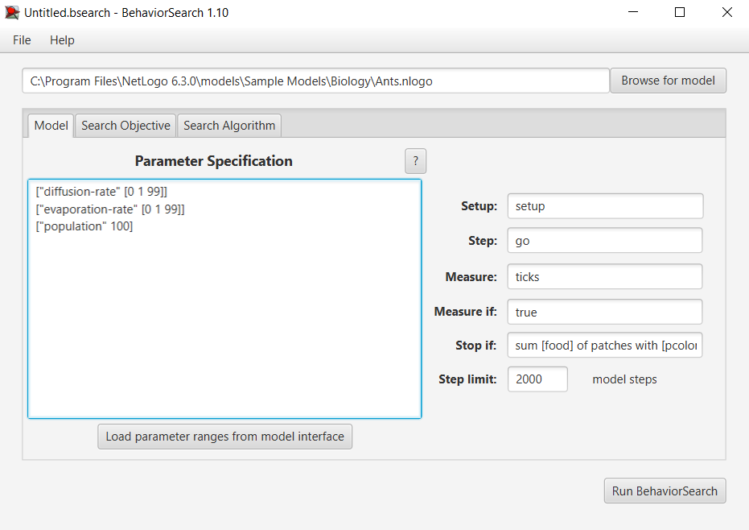
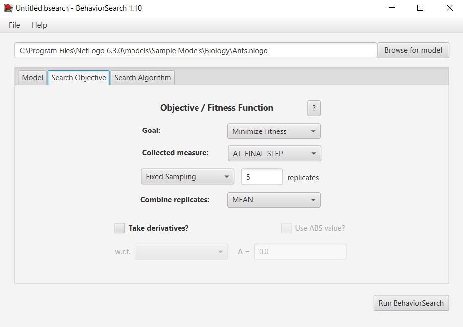
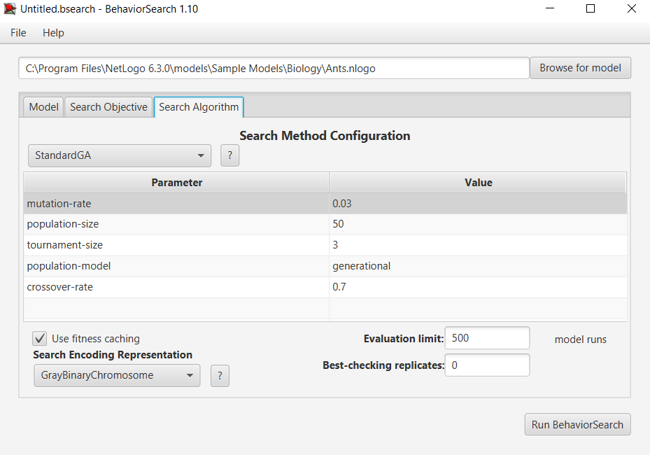
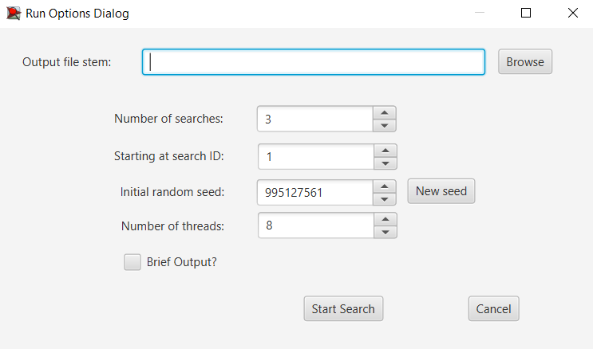
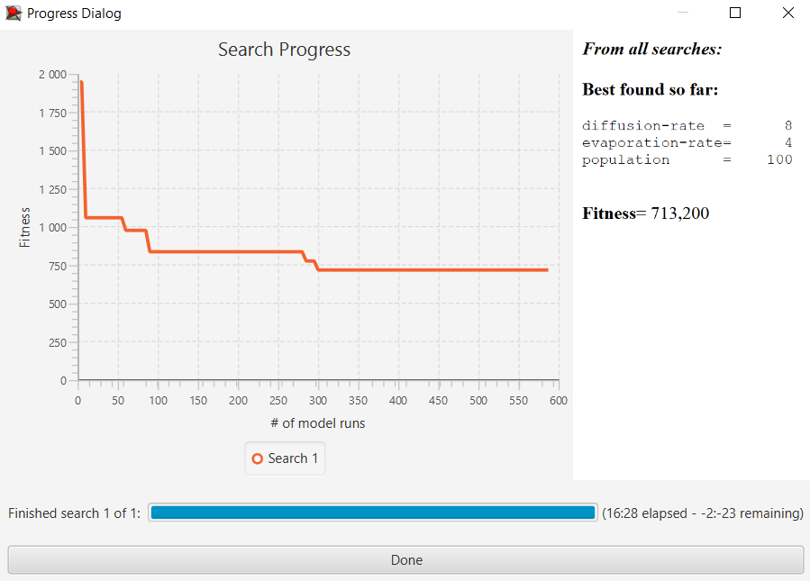
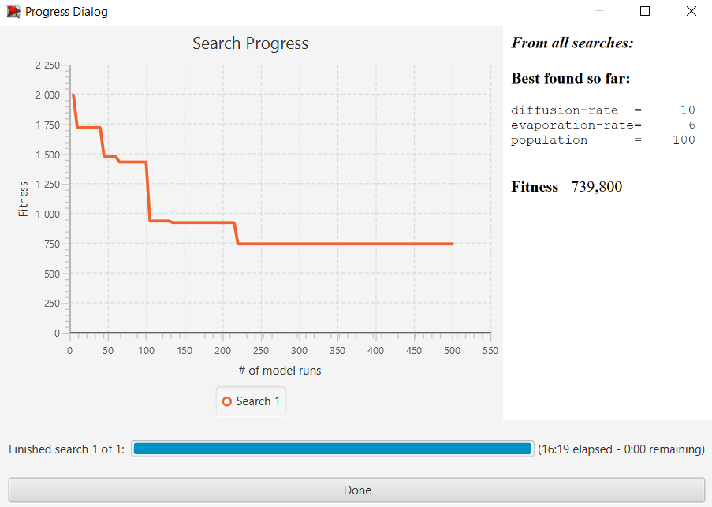

## Комп'ютерні системи імітаційного моделювання
## СПм-22-3, **Коломоєць Владислав Сергійович**
### Лабораторна робота №**3**. Використання засобів обчислювального интелекту для оптимізації імітаційних моделей

 

### Варіант 10, модель у середовищі NetLogo:
[Ants](https://www.netlogoweb.org/launch#http://www.netlogoweb.org/assets/modelslib/Sample%20Models/Biology/Ants.nlogo)

 

#### Вербальний опис моделі:

- **https://github.com/vlad161200/KSIM_laba1**

 

### Налаштування середовища BehaviorSearch:

**Обрана модель**:
<pre>
C:\Program Files\NetLogo 6.3.0\models\Sample Models\Biology\Ants.nlogo
</pre>

**Параметри моделі** (вкладка Model):  
<pre>
["diffusion-rate" [0 1 99]]
["evaporation-rate" [0 1 99]]
["population" 100]
</pre>

Використовувана **міра**:  
Для фітнес-функції *(вона ж функція пристосованості або цільова функція)* було обрано **кількість тіків з початку симуляції**. Використано звичайний лічільник ticks.  
та вказано у параметрі "**Measure**":
<pre>
ticks
</pre>

Кількість тіків з початку симуляції має враховуватись **на останньому кроці**. 
Параметр зупинки за умовою ("**Stop if**"): 
<pre>
sum [food] of patches with [pcolor = blue or pcolor = sky or pcolor = cyan] = 0
</pre>
Загальний вигляд вкладки налаштувань параметрів моделі:  

**Налаштування цільової функції** (вкладка Search Objective):  
Метою підбору параметрів імітаційної моделі, що описує збор їжі мурахами, є **мінімізація** значення часу за який вони збирають їжу. "**Goal**" зі значенням **Minimize Fitness**. Тобто необхідно визначити такі параметри налаштувань моделі, у яких мурази збирають всю їжу за мінімальний час. 
Щоб уникнути викривлення результатів через випадкові значення, що використовуються в логіці самої імітаційної моделі, **кожна симуляція повторюється по 5 разів**, результуюче значення розраховується як **середнє арифметичне**. 
Загальний вигляд вкладки налаштувань цільової функції:  

**Налаштування алгоритму пошуку** (вкладка Search Algorithm):  

Загальний вид вкладки налаштувань алгоритму пошуку:  

 

### Результати використання BehaviorSearch:
Діалогове вікно запуску пошуку *(можна залишити за замовчуванням, але стежте, куди пишеться результат)*:  

Результат пошуку параметрів імітаційної моделі, використовуючи **генетичний алгоритм**:  

Результат пошуку параметрів імітаційної моделі, використовуючи **випадковий пошук**:  

